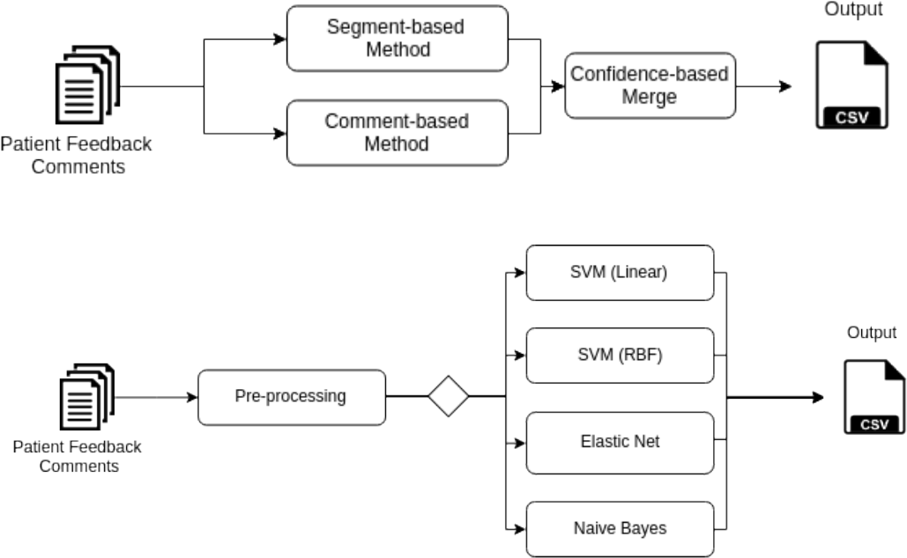

## Patient Opinion Mining
In this project, I explore to what extent we can use machine learning methods to automatically classify patient 
comments in a set of key topics, including, among others, staff attitude, care quality, environment and 
waiting time. I present an annotated gold-standard corpus developed in two different NHS settings
in the UK (general hospital and mental health trust) and two methods based on individual segment- and entire
comment-level modelling. The models use various machine learning methods and rely on n-grams features.

