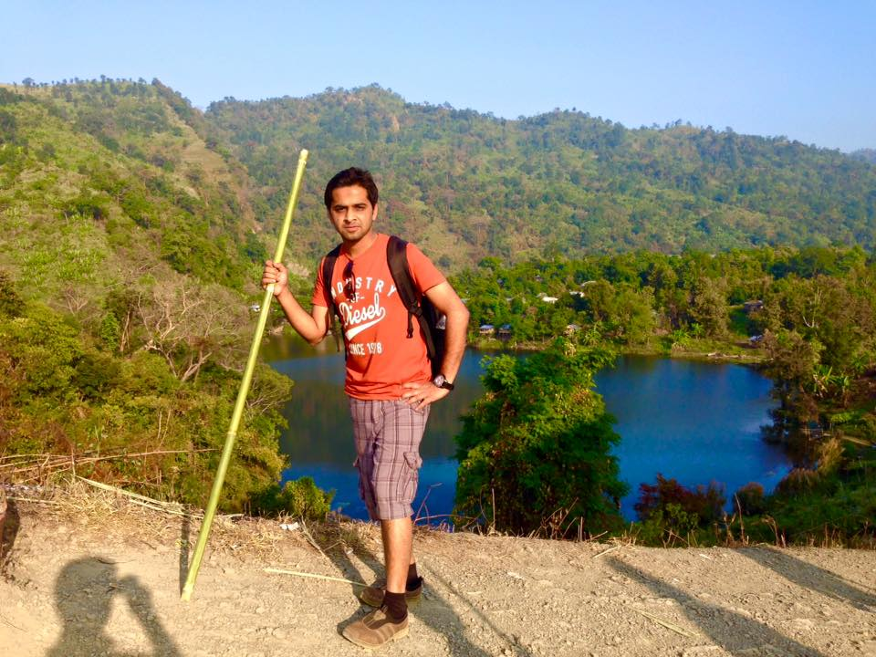
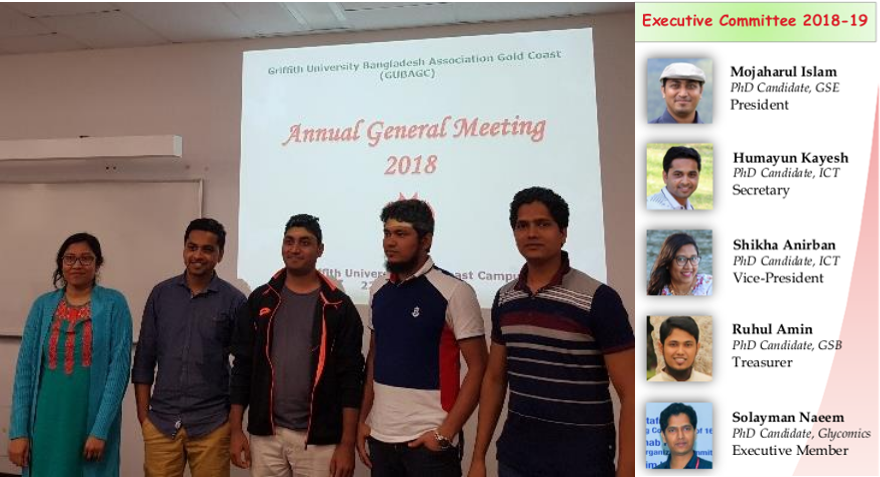

## Bio
A highly motivated Machine Learning Engineer with a Ph.D. in NLP and Machine Learning, I am passionate about leveraging data to create impactful solutions across diverse industries such as healthcare, finance, and marketing.

With a proven track record in machine learning, I have developed serverless scraping applications, integrated GPT-4, and devised frameworks for continuous learning and evaluation.

Proficient in advanced NLP techniques, I excel in extracting valuable insights, modeling causal relationships, and employing methods like topic modeling and sentiment detection.

Demonstrating full-stack capabilities, I have successfully developed hybrid mobile applications, built APIs, and overseen software development lifecycles using Agile methodologies.

My Ph.D. research delved into automatically detecting causal relationships in social media data, unlocking powerful potential for decision-making and predictive analytics.

I am enthusiastic about leveraging my deep technical expertise to push the boundaries of data-driven solutions.

## Hobby 
In my free time, I enjoy hiking. This activity serves as an exceptional avenue for discovering new locales and immersing myself in the wonders of nature. My preferred destinations encompass mountains, lakes, beaches, and forests, each providing a unique and enriching experience.

One of the most memorable expedition took place in 2015, where I visited to the pristine ["Boga Lake"](https://en.wikipedia.org/wiki/Bagakain_Lake) in the hill district of Bandarban, Bangladesh. This remote lake, nestled amidst captivating landscapes, epitomizes the kind of off-the-beaten-path exploration that fuels my passion for outdoor adventure. The photograph captured during this expedition encapsulates the essence of my connection with nature and the joy derived from such immersive experiences.

## Leadership Roles
In addition to my technical endeavors, I served as the Secretary of Griffith University Bangladeshi Association Gold Coast (GUBAGC) during the 2018-19 session, demonstrating my leadership and organizational capabilities. In this role, I took charge of the student club, overseeing and orchestrating a range of student engagement and cultural programs. From coordinating study tours and seminars to conducting one-to-one advisory sessions, my aim was to enhance the academic and social experiences of Bangladeshi students at Griffith University in Gold Coast, Australia. This leadership position allowed me to contribute to the community and foster a supportive environment for fellow students, showcasing my commitment to both technical excellence and community building.

## Get in Touch
<!-- Get in touch form -->

<form
  action="https://formspree.io/f/moqgqwal"
  method="POST"
><label>
    Your name
    <input type="text" name="name" class = 'form-control' required>
  </label>
  <label>
    Your email address
    <input type="email" name="email" class = 'form-control' required>
  </label>
  <label>
    Your message
    <textarea name="message" class = 'form-control' required></textarea>
  </label>
  <!-- your other form fields go here -->
  <button type="submit" class ="btn btn--primary">Send</button>
</form>
